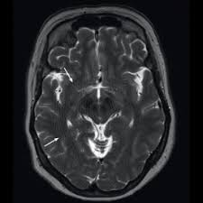
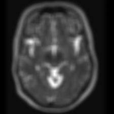
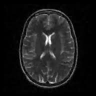
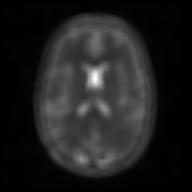
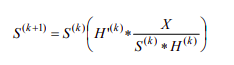
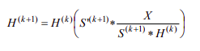

# ImageProcessing_RestorationProject
Final project developed to the SCC-0251 Image Processing Course at ICMC-USP.

## Grupo
 * [João Victor Sene Araújo](https://github.com/JoaoVSene) - nUSP: 11796382
 * [Pedro Augusto Ribeiro Gomes](https://github.com/pedroaurgomes) - nUSP: 11819125

## Abstract 

As imagens médicas obtidas a partir de exames de ressonância magnética (MRI scans) frequentemente apresentam danos á sua qualidade, normalmente pelo fato 
do paciente ter se movido durante o procedimento de aquisição da imagem, problemas no equipamento, entre outras coisas. O objetivo principal do projeto é receber essas imagens
danificadas na entrada e aplicar técnicas de restauração de imagens a fim de facilitar a visualização das mesmas por parte dos profissionais da área da
saúde, possibilitando assim que o diagnóstico possa ser dado de forma eficiente, sem que o exame precise ser repetido.

## Principais tarefas de processamento de imagem:
 * Restauração 

## Aplicação:
 * Imagens médicas

## Metodologia e Desenvolvimento

Primeiramente, obtivemos as imagens de ressonância magnética (MRI) de input a partir de um [Dataset](https://www.kaggle.com/datasets/navoneel/brain-mri-images-for-brain-tumor-detection) disponível no [Kaggle](https://www.kaggle.com/). No entanto, as imagens encontradas não apresentam danos suficientes 
que justificam reparo. Por esse motivo, optou-se por uma etapa de pré-processamento das imagens, na qual será inserido um efeito de degradação nas imagens com o intuito de simular acidentes que podem ocorrer na realidade, utilizando filtros de blur.

### [Algoritmo de pré-processamento](./src/PreProcBlurring.ipynb)

Exemplos de pré-processamento:  

| Original | Pré-processada|
|----------|---------------|
|||
|||

Após o pré-processamento, as imagens serão enviadas como entrada ao algoritmo que efetuará o processo de restauração.

Assim, considerando que a imagem real 'X' obtida pelo equipamento utilizado possui certos defeitos e ruídos, temos a seguinte relação:

X = I * H + N

, onde I é a imagem ideal, H é uma PSF (Point Spread Function) e N uma matrix que representa os ruídos.

Com isso, nosso objetivo é utilizar uma metodologia que permita, partindo somente da imagem X, nos aproximar da imagem ideal I.

Desse modo, a intenção é utilizar um método de deconvolução cega (Blind Deconvolution), uma vez que em situações reais não dispomos do conhecimento
da função de degradação (Point Spread Function). Sendo assim, após realizar uma pesquisa na literatura sobre os algoritmos existentes, foi decidido
que seria utilizado o Algoritmo de Deconvolução Cega Richardson-Lucy, o qual estima a imagem restaurada a partir da imagem dada na entrada, bem como
a PSF, a partir de uma PSF inicial arbitrária, após uma série de iterações.

Notebook:
### [Algoritmo de Restauração](./src/FinalProjectRestorationRL.ipynb)

#### Modelo RL para estimar a imagem restaurada:  

#### Modelo RL  para estimar a PSF:  

Desenvolvemos o algoritmo RL (blind) para restauração, e o comparamos com 2 outras abordagens (non-blind).

### Conclusão:
Blind deconvolution caracteriza uma classe de técnicas e algoritmos que possuem grande potencial na solução de problemas de restauração de imagens, justamente pela 
sua proposta de restaurar a imagem sem ter acesso à função que a degradou. No entanto, ainda é um problema em aberto, afinal, como pudemos perceber, os resultados 
das principais técnicas existentes atualmente não são muito satisfatórios. 

### Problemas encontrados
Além de ser um problema em aberto, tivemos outras dificuldades para a confecção do projeto. Como temos muitas estruturas de dados em Python,foi muito difícil achar 
algoritmos de blind deconvolution implementados nessa linguagem (foram achados muitos em matlab), sendo assim, outro grande desafio foi encontrar bons exemplos para 
serem usado como referência e fonte de pesquisa. 

**Referência:**
[Yu A Bunyak, O Yu Sofina and R N Kvetnyy 2012 Blind PSF estimation and methods of deconvolution optimization](https://arxiv.org/ftp/arxiv/papers/1206/1206.3594.pdf)

